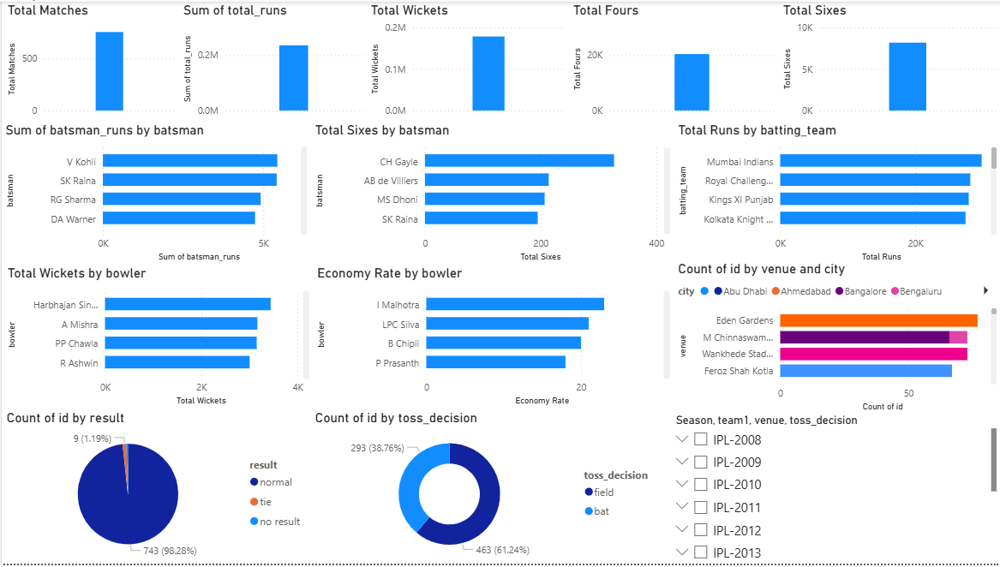
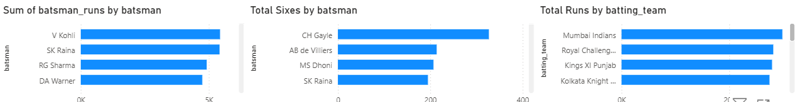

# 🏏 **IPL Analytics Dashboard (Power BI)**

A complete **Power BI analytics dashboard** built using IPL ball-by-ball and match-level data (2008–2020).  
This project provides insights into **batting performance, bowling efficiency, match outcomes, venues, and team statistics** using clean data modeling and DAX.

The goal is to showcase real-world **Business Intelligence**, **dashboard design**, and **data storytelling** skills.

---

## 📊 **Dashboard Preview**

### 🔹 Full Dashboard  


### 🔹 Batting Analysis  


### 🔹 Bowling Analysis  


---

## 📁 **Dataset**

Source: Kaggle – IPL Complete Dataset (2008–2020)  
Includes 2 main tables:

- **matches.csv** – Match-level info (team1, team2, toss, result, venue, season…)  
- **deliveries.csv** – Ball-by-ball details (batsman, bowler, runs, wickets…)

---

## 🛠️ **Data Model**

The relationship used:

matches[id] 1 ────∞ deliveries[match_id]


- One-to-many  
- Single direction (Matches → Deliveries)

This allows aggregated calculations across seasons, venues, teams, and innings.

---

## 🧮 **DAX Measures Used**

```DAX
Total Runs = SUM(deliveries.total_runs)

Total Matches = COUNT(matches.id)

Total Fours =
CALCULATE(
    COUNTROWS(deliveries),
    deliveries.batsman_runs = 4
)

Total Sixes =
CALCULATE(
    COUNTROWS(deliveries),
    deliveries.batsman_runs = 6
)

Total Wickets =
CALCULATE(
    COUNTROWS(deliveries),
    deliveries.dismissal_kind <> "run out" &&
    NOT(ISBLANK(deliveries.dismissal_kind))
)

Strike Rate =
DIVIDE(
    SUM(deliveries.batsman_runs) * 100,
    COUNTROWS(deliveries)
)

Economy Rate =
DIVIDE(
    SUM(deliveries.total_runs),
    COUNTROWS(deliveries) / 6
)

## 📈 Key Insights

- Teams with stronger **opening partnerships** tend to dominate tournaments.
- **Chennai, Mumbai, Kolkata** host the most matches historically.
- Bowlers with lower **economy rates** correlate strongly with match-winning performances.
- **Six-hitting ability** has increased consistently across seasons.
- Toss decisions strongly influence match outcomes, especially in night matches.

---

## 🧩 Features of the Dashboard

✔ KPI Cards: Total Runs, Matches, Fours, Sixes, Wickets  
✔ Top Run Scorers  
✔ Top Six Hitters  
✔ Best Wicket Takers  
✔ Economy Rate Rankings  
✔ Venue-wise Matches  
✔ Toss Decision Analysis  
✔ Match Result Breakdown  
✔ Season / Team / Venue Filters  
✔ Fully interactive & business-ready layout  

---

## 🚀 How to Use

1. Download `IPL_Dashboard.pbix`  
2. Open in Power BI Desktop  
3. Interact using slicers (Season, Team, Venue)  
4. Explore batting, bowling, and match insights  

---

## 👨‍💻 Author

**Vivek S. Chindalia**  
B.E. Information Technology — Mumbai University  
📧 chindaliavivek@gmail.com  
🔗 GitHub: https://github.com/chindaliavivek


